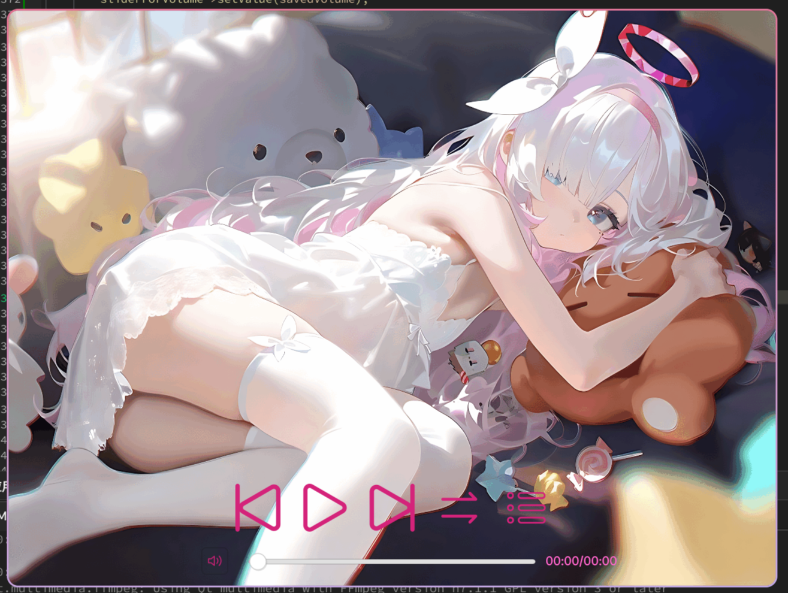
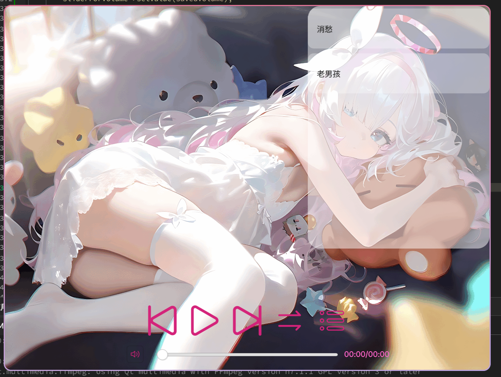
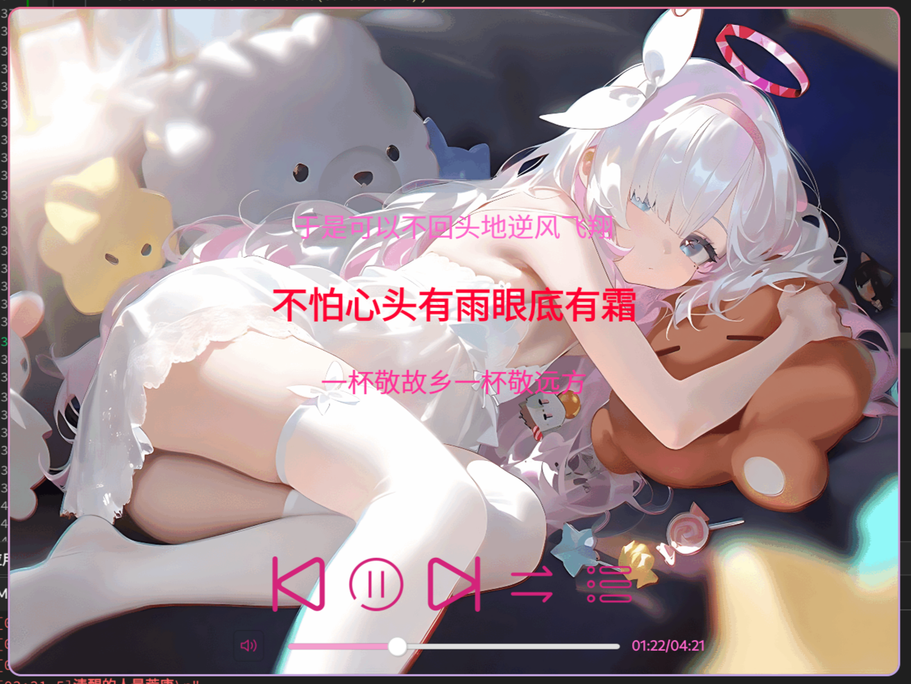

# 💤EastMusic+Qt

## 演示图片

### 主页面

### 列表

### 歌词

## 版本要求

**Qt6.0及以上**

## 项目树

.
├── CMakeLists.txt
├── CMakeLists.txt.user
├── icon.qrc
├── images
│   	├── list.png
│   	├── lyrics.png
│   	└── main.png
├── lyrices.cpp
├── lyrices.h
├── lyricswidget.cpp
├── lyricswidget.h
├── main.cpp
├── mainwindow.cpp
├── mainwindow.h
├── mainwindow.ui
├── README.md
├── resource
│   	└──*.png
├── settings.cpp
└── settings.h
