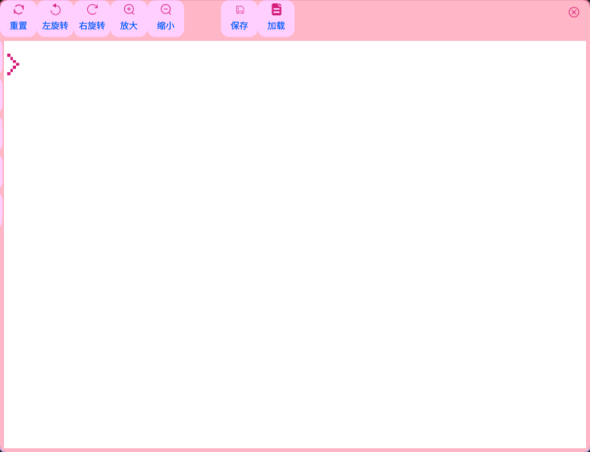
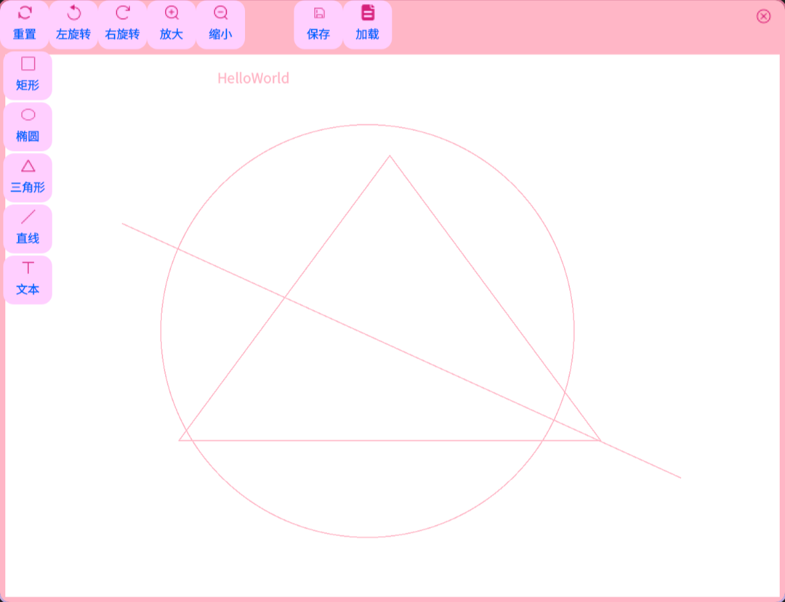

# EasyPaint

## 演示图片

## 实现细节

- 版本Qt6.0+
- Qt核心机制
  - 信号与槽：通过`connect()`实现按钮点击与功能调用的解耦（如旋转、缩放操作）
  - 事件处理：重写`mousePressEvent`、`mouseMoveEvent`等实现交互逻辑
  - 对象模型：使用QObject的父子内存管理机制（如按钮自动随窗口销毁）
- 图形绘制
  - QPainter系统：
    - 基本图形绘制（矩形/椭圆/三角形/直线）
    - 坐标系变换（`scale()`/`rotate()`/`translate()`实现缩放和旋转）
    - 逻辑坐标与物理坐标转换（`physicalToLogical`/`logicalToPhysical`）
  - OpenGL集成：继承`QOpenGLWidget`获得硬件加速能力
- 设计模式应用：
  - 命令模式：每个图形操作（绘制/旋转/缩放）封装为独立操作
    - 基类型：Shape
    - 子类型：
      - Rectangle
      - Ellipse
      - Triangle
      - Line
      - Text
  - 单例模式：`StaticData::GetStaticData()`管理全局图形数据
  - 策略模式：通过`ShapeType`切换不同绘图算法
- Json应用
  - 通过对json的组织和解析实现了文件的保存和加载

## 项目结构

.
├── CMakeLists.txt
├── CMakeLists.txt.user
├── contenteditor.cpp
├── contenteditor.h
├── drawwidget.cpp
├── drawwidget.h
├── main.cpp
├── mainwindow.cpp
├── mainwindow.h
├── Micro.h
├── README.md
├── resources
│   └── *.png
├── resources.qrc
├── Shape
│   ├── cursor.cpp
│   ├── cursor.h
│   ├── ellipse.cpp
│   ├── ellipse.h
│   ├── line.cpp
│   ├── line.h
│   ├── rectangle.cpp
│   ├── rectangle.h
│   ├── shape.cpp
│   ├── shape.h
│   ├── text.cpp
│   ├── text.h
│   ├── triangle.cpp
│   └── triangle.h
├── staticdata.cpp
└── staticdata.h

## 不足与改进

我们只是实现了画图的最基本的功能，矩形，三角形，圆形等等。还有许多可以加添的内容，比如

- 切换笔刷的颜色，粗细，填充方式
- 改变笔的文字样式，大小
- 回退，重做
- 画布的拖拽，背景色
- ...

考虑到时间问题，就先实现如此版本。

